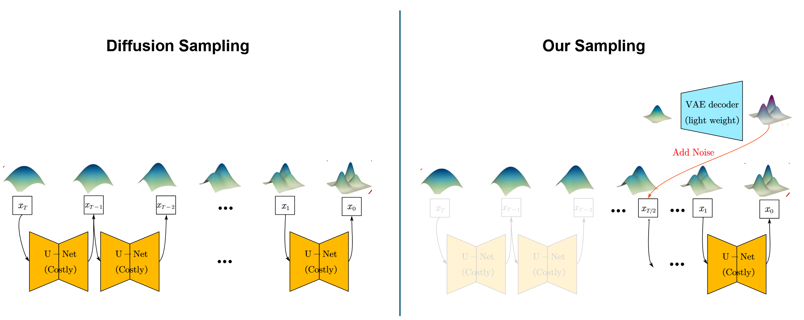

# 6.S978 Course Project: Speeding Up Diffusion Models with One-step Generators  



[presentation slides](https://docs.google.com/presentation/d/1133fIbl01ey44OWSUnUvfYG6liOJe7dOcw6m9tKmvoY) | [blog post](https://hope7happiness.github.io/accel_diff)

*By: Zhicheng Jiang, Hanhong Zhao*

## Introduction

You may reproduce most of our results with the interactive notebooks in this repository. The codes are organized as follows:

- `main.ipynb`: the model training part. Including the baseline DDPM, our "half-ddpm", and decreased size half-ddpm; also, the training of baseline Flow-Matching model, and "half-flow-matching" model.
- `sample.ipynb`: the sampling and experiment parts. Including:
    - Sanity check of VAE, DDPM and Flow Matching Checkpoints
    - Merge VAE and DDPM with our method, and reducing the sampling steps to 500, 400, 300 and 100 respectively;
    - Merge VAE and a very light-weighted DDPM;
    - The experiment on scaling the VAE generated images;
    - The experiment on ODE sampler and Flow Matching Models.

<!-- - `fid.ipynb`: repeat most of the experiments in `sample.ipynb`, but with FID evaluation. To run the FID part, please first do the following commands:

```bash
python dataset_tool.py --source /path/to/your/MNIST/dataset/train-images-idx3-ubyte.gz --dest ./mnist_fid_cache
pip install clean-fid
``` -->

All the computations can be done on a single NVIDIA RTX 4090 GPU in a reasonable amount of time. We use Pytorch 2.4.1 and Python 3.10.0.

<!-- The FID evaluation is done with the [clean-fid](https://github.com/GaParmar/clean-fid) package. -->

## Acknowledgement

Some of the neural network structures or training hyperparameters are borrowed from the homework of the course. We also use some of the figures from the lecture slides.
